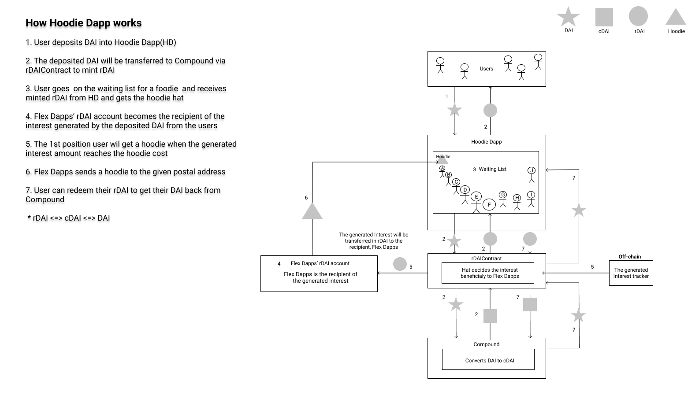

# Hoodie contract
This contract utilizes [rToken contract](https://github.com/decentral-ee/rtoken-contracts) and [Compound](https://github.com/compound-finance). Users will deposit their DAI into this dapp and can get an original hoodie from [Flex Dapps](https://flexdapps.com/about) when the generated interest amount reaches the hoodie cost.

## How this dapp works

## Spec
* Users can change their rDAI hat to the dapp’s one before using
* Users can approve of the dapp transferring their DAI to Compound
* Users can mint rDAI through the dapp
* Users can redeem their rDAI and the DAI they deposited will be given back to them
* The generated interest will be redirected to the Flex Dapps’ rDAI account for the hoodie cost
* Hoodie will be given to the 1st position user automatically when the generated interest amount has reached the cost

## Waiting list
### Case1 - When there is no waiting user
A user will be given the 1st position in the waiting list

### Case2 - When there is more than 1 user
A user will be given the last position in the waiting list

### Case3 - When a user’s deposited amount becomes below than the minimum deposit amount
A user will be removed from the waiting list

### Case4 - When an existing user who is not in the waiting list tops up their deposit and the amount reaches the minimum amount
A user will be added into the waiting list and given the last position

### Case5 - After issuing a hoodie to the 1st position user
The user will be given the last position and the 2nd position user will be the next recipient

### Case6 - When the 1st position user redeems their rDAI and becomes out of the waiting list before the generated interest amount reaches the hoodie cost
The 2nd position user will be the next recipient

### Case7 - When the generated interest amount reaches the hoodie cost but there is no waiting user
No one receives a hoodie and the generated interest amount will be transferred to Flex Dapps’ rDAI account